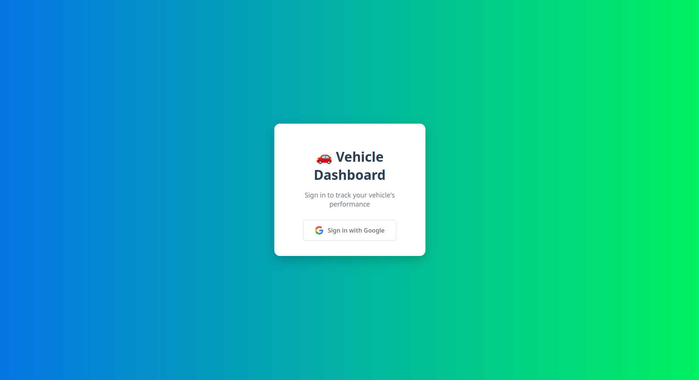
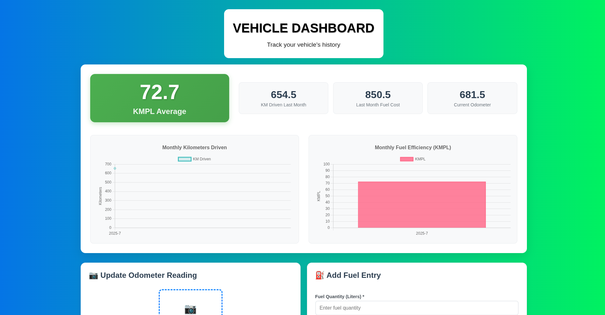

# 🚗 Vehicle Dashboard

A full-stack application for tracking vehicle mileage, fuel entries, and statistics, featuring:
- **Google Sign-In (Supabase Auth)**
- **Frontend: React / JavaScript**
- **Data Storage: Supabase PostgreSQL with Row Level Security**
- **Odometer OCR: Flask backend via HTTP API**

---

## Table of Contents

- [Screenshots](#screenshots)
- [Features](#features)
- [Live Demo](#live-demo)
- [Getting Started](#getting-started)
- [Tech Stack](#tech-stack)
- [Project Structure](#project-structure)
- [Database Schema & Security](#database-schema--security)
- [Supabase Setup](#supabase-setup)
- [OCR Backend Setup](#ocr-backend-setup)
- [Usage](#usage)
- [Roadmap / TODO](#roadmap--todo)
- [License](#license)

---

## Screenshots

<!--
Replace the links below with your screenshots.
You can drag and drop images into your markdown editor or upload via the GitHub interface to get image URLs.
-->

| Login Page                 | Dashboard Home             |
|----------------------------|---------------------------|
|  |  |

---

## Features

- 📈 **View vehicle performance:** Total distance, average mileage, fuel logs, charts.
- ✍️ **Add odometer readings:** Upload an image, server extracts value using OCR.
- 💡 **Secure:** Google login via Supabase Auth + RLS (Row Level Security).
- 🛡 **Multi-user:** Every user’s data is private & segregated.
- 🖼 **Add & view fuel entries:** Record details, date, price/amount, and manage history.

---

## Live Demo

<!--
Add your live deployment link here (e.g., Vercel, Netlify, your own domain)
-->
[View live app](https://fuel-dashboard-frontend.vercel.app/)

---

## Getting Started

### Prerequisites

- Node.js (v18+ recommended)
- npm or yarn
- Python 3 (for backend)
- Supabase account ([sign up](https://supabase.io))

### Clone the repository

```bash
git clone https://github.com/prajjwalbajpai/fuel-dashboard-frontend
cd fuel-dashboard-frontend
```


### Frontend Setup

```bash
npm install
Add your .env or put Supabase keys in src/supabaseClient.js as shown below
```

Edit `src/supabaseClient.js` with your project values:

```js
import { createClient } from '@supabase/supabase-js';
const supabaseUrl = 'https://YOUR-PROJECT.supabase.co';
const supabaseKey = 'YOUR_ANON_KEY';
export const supabase = createClient(supabaseUrl, supabaseKey);
```

Start the development server:

```bash
npm start
```

### OCR Backend (Flask) Setup

```bash
cd backend
python3 -m venv venv
source venv/bin/activate # Windows: venv\Scripts\activate
pip install -r requirements.txt
```
Add/update .env if needed
Start the server (adjust host/port as needed)

```bash
python run.py
```
---

## Tech Stack

- **Frontend:** React, Supabase JS
- **Authentication:** Supabase Auth (Google provider)
- **Database:** Supabase PostgreSQL, Row Level Security
- **Backend OCR:** Python (Flask), rapidocr/paddleocr
- **Deployment:** Compatible with Netlify/Vercel (frontend); PythonAnywhere/Render/Fly.io/Heroku (backend)
- **APIs:** REST (for OCR), Supabase client for DB

---

## Project Structure
```bash
vehicle-dashboard/
├── public/
│ ├── index.html
│ ├── favicon.ico
│ └── ... (other static assets)
├── src/
│ ├── components/
│ │ ├── VehicleDashboard.js
│ │ ├── OdometerUpload.js
│ │ ├── FuelEntry.js
│ │ ├── Login.js
│ │ ├── VehicleDashboard.css
│ │ ├── OdometerUpload.css
│ │ ├── FuelEntry.css
│ │ └── Login.css
│ ├── App.js
│ ├── App.css
│ ├── index.js
│ ├── index.css
│ ├── supabaseClient.js
│ └── ... (utils, hooks, helpers, etc.)
├── package.json
├── README.md
├── .gitignore
└── ... (other config or documentation files)
```
---

## Database Schema & Security

- **users:** Stores your app user data (linked to Supabase Auth users by UID).
- **odometer_readings:** { id, user_id, reading, image_path, created_at }
- **fuel_entries:** { id, user_id, fuel_quantity, fuel_price, current_reading, entry_date, created_at }

**Security:**  
All tables use Row Level Security so users can only access (read/write) their own data.

Example RLS policy for fuel_entries:
```sql
CREATE POLICY "User can insert their fuel_entries"
ON public.fuel_entries
FOR INSERT TO authenticated
WITH CHECK (user_id = auth.uid());
```

---

## Supabase Setup

1. **Create a Supabase project** at [supabase.io](https://supabase.io).
2. **Enable Google Auth** under Authentication > Providers. [Google Setup Guide](https://supabase.com/docs/guides/auth/social-login/auth-google).
3. **Set up tables:** Use the provided schema in the SQL editor.
4. **Set up RLS policies:** Enable RLS and use policies (see above).
5. **Get your project URL and anon key for frontend setup.**

---

## OCR Backend Setup

- Flask server provides `/ocr` endpoint.
- Accepts an image (form-data), returns JSON with predicted odometer reading.
- Update [CORS](https://flask-cors.readthedocs.io/) settings to allow requests from your frontend’s origin.

---

## Usage

1. **Sign in with Google.**
2. **Add/upload odometer image** or enter reading.
3. **Add fuel entries** as you refuel.
4. **View charts, mileage history, and other stats.**

---

## Roadmap / TODO

- [ ] ❤️ Add support for multiple vehicles
- [ ] 🎨 Improve UI/UX & mobile responsiveness
- [ ] 🗺 Map-based trip log
- [ ] 🔔 Email/Push notifications for service reminders
- [ ] ⏱ Offline PWA support

---

## License

[MIT](LICENSE)

---
